# Feeds Manual

**Version：v1.0.2**

## 1. Introduction

Feeds is a Capsule project based on elastOS. Since its inception, elastOS has championed the tagline "Own your data" and Feeds exemplifies this principled vision.

Feeds is a decentralized social networking platform dedicated to serving public discussion and enabling users to post their lives and ideas. Users can deploy servers independently with Feeds Service on the device and fully control their data.

## 2. How to Install Feeds

### 2.1 Download and Install elastOS

elastOS is available on the Google Play Store, and at QR code below.

### 2.2 Download and install Feeds in elastOS

* Click the link to install Feeds via elastOS:

   [https://scheme.elastos.org/app?id=org.elastos.dapp.Feeds](https://scheme.elastos.org/app?id=org.elastos.dapp.feeds)

* Download and Install Feeds in elastOS

   1. Click the elastOS icon to open elastOS and land on the homepage:

      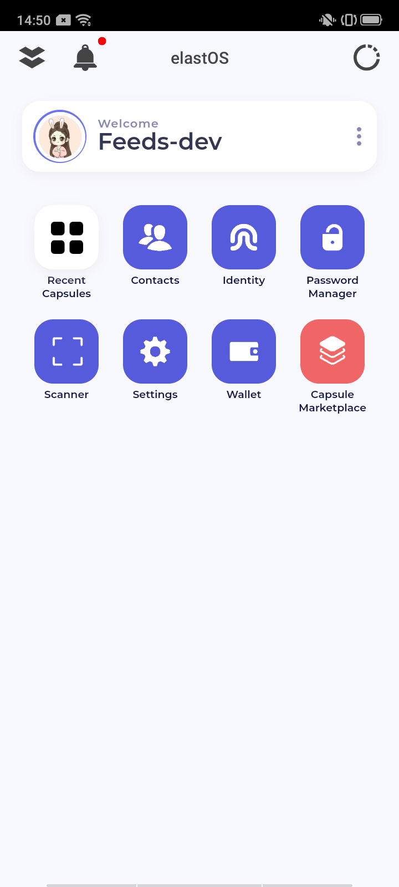

   2. Open "Capsule Marketplace",enter "Feeds" in the search box, and click "INSTALL".

      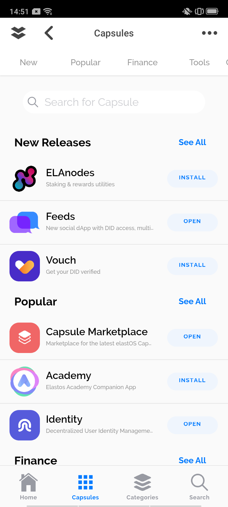

   3. Under "Recent Capsules", click "Favorites" in the right hand menu to add Feeds to Favorites. Feeds will appear on the main interface of elastOS for subsequent use.

      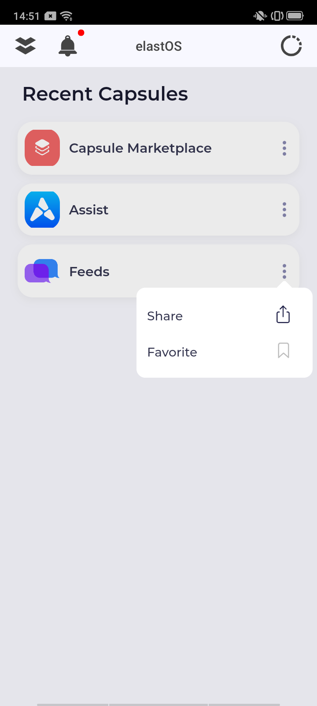

## 3. How to Add a Feed source？

Users are able to add third-party Feeds Sources. For users that do not want to post, it is not necessary to deploy services and bind Feeds sources.

By default, Feeds does not provide any Feeds sources; users must find the desired Feeds source in order to scan the QR code. Of course, users can also add the Feeds Sources recommended in the ensuing section.

### 3.1 Recommended Feeds Sources

* Feeds Dev

  

* elastOS

  

* Tuum Tech

  

### 3.2 Adding a Feed Source

1. Open the Feeds Capsule, use the DID login function to enter the homepage (the DID identity must be published on-chain. If you do not know how to publish it, please find the answer in the "FAQ" section).
2. Click the icon in the upper right corner to enter the menu page:

   

3. Click to enter the "Feeds Sources" interface. If a Feed Source has not already been bound or added, click "Add an existing Feed Source" on the picture below-left; if it has been added, click "Add a New Feed Source" on the picture below-right.

   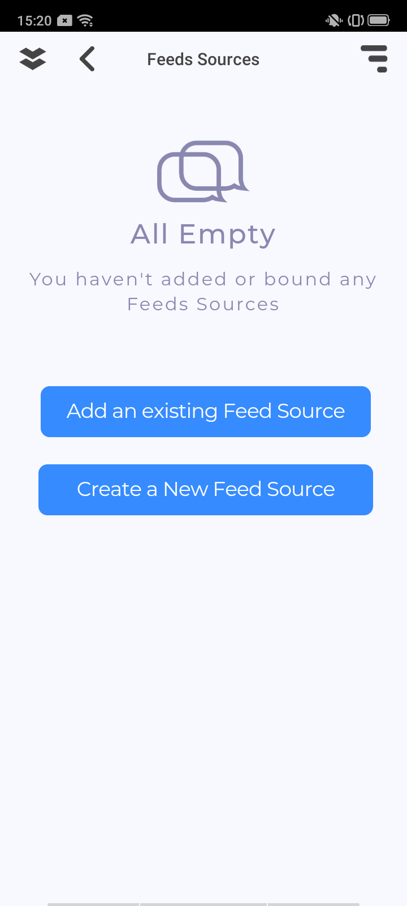![Image]Image/en/feedsadd-3.jpg)

4. Enter the"AddaFeedSource"interface.You can add Feed sources in the following two ways:

* Enter "Feeds url" (format:Feeds://did/address) in the input box, and click "Confirm";
* Click "Open QR Scanner" to scan the QR code of the Feed source;

  After confirming that it is correct, click "Add a Feed Source",the FeedSource is added successfully.

  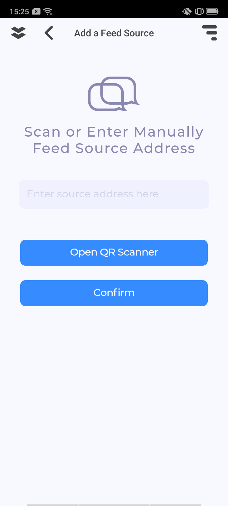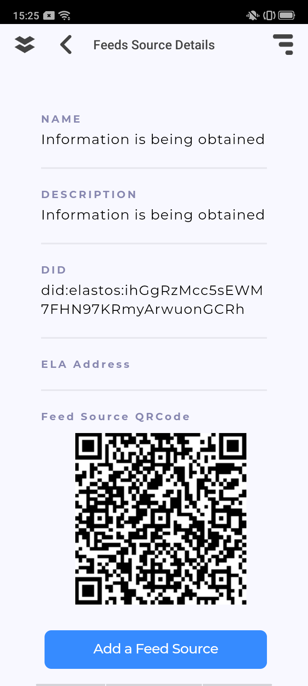

5. After the FeedSource is successfully added, you will see the newly added FeedSource on the Feeds Sources interface.

   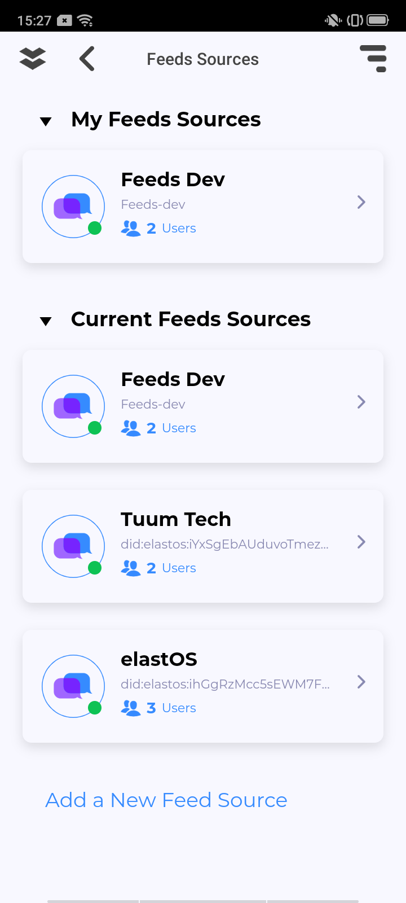

6. Enter the "Explore Feeds" interface and refresh the interface to load all the Feeds created under the added Feeds Sources. After following the Feeds, users can view all published posts by the following Feeds under "My Feeds Timeline". Users can publish Posts, like Posts from others, and add comments.

   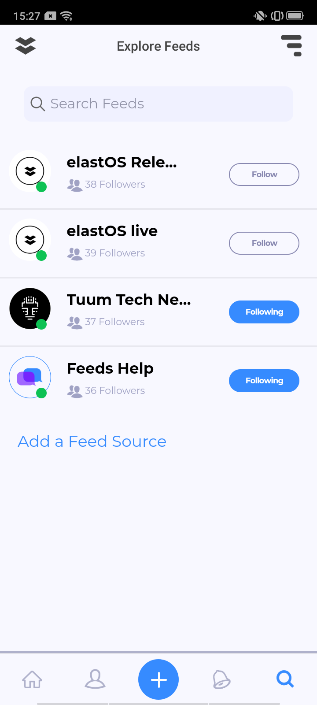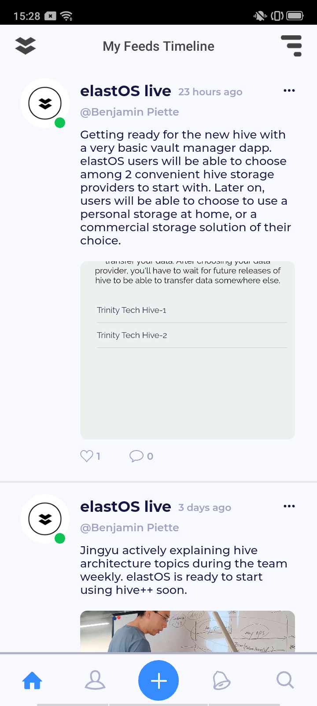

## 4. How to publish a Post？

For a user to publish a Post, he or she must initiate the service to generate the Feeds Source. Feeds can be created only after binding the Feeds source, and only with the Feeds can the Post be published.

### 4.1 Start Feeds Service

Currently supports Mac and Linux debian distributions.

#### 4.1.1 Mac

1. Download service installation package

   Open the link to download on a PC browser:

   [https://github.com/elastos-trinity/feeds-service/releases/download/release-v1.0.1/Feeds.Service.app.macos.tar.gz](https://github.com/elastos-trinity/feeds-service/releases/download/release-v1.0.1/Feeds.Service.app.macos.tar.gz)

2. Start the installation of Feeds Service

* After downloading, unzip and open the Feeds Service.app, as shown below:

  

* Clicking on the "Feeds Service" application icon will start the installation, and a running window will pop up, as shown below. Then, a page requesting a link will pop up at the same time. Click "Allow". If you are unable to open it, please refer to "FAQ" for troubleshooting.

  

  Copy the URL link "[http://localhost:10080/](http://localhost:10080/ )" in the above window, paste in the browser, and open it. A QR code will be displayed, which will be scanned by the Feeds Capsule to bind the service.

#### 4.1.2 Ubuntu(amd64 debian/ubuntu)

1. Download service installation package

   Open the link to download on a PC browser:

   [https://github.com/elastos-trinity/feeds-service/releases/download/release-v1.0.1/feedsd_1.0.1_amd64_ubuntu_2004.deb](https://github.com/elastos-trinity/feeds-service/releases/download/release-v1.0.1/feedsd_1.0.1_amd64_ubuntu_2004.deb)

2. Start the installation ofFeeds Service

   Select the installation package corresponding to x86_64 debian/ubuntu to download and open:

   

   After the download is complete, automatically enter the corresponding installation package interface in "Ubuntu Software":

   

   Click "Install", and enter the computer password as prompted:

   

   After the installation is complete, the installation package interface displayed above shows that the "Install" button changes to "Remove".

   

   Open the link on the browser:[http://localhost:10080/](http://localhost:10080/), and a QR code will be displayed, which is waiting for the Feeds Capsule to scan in order to bind the service.

#### 4.1.3 Ubuntu(arm debian/ubuntu)

1. Download service installation package

   Open the link to download:

   [https://github.com/elastos-trinity/feeds-service/releases/download/release-v1.0.1/feedsd_1.0.1_armhf_raspbian.deb](https://github.com/elastos-trinity/feeds-service/releases/download/release-v1.0.1/feedsd_1.0.1_armhf_raspbian.deb)

2. Start the installation of Feeds Service

   This process is similar to 4.1.2 (x86_64 debian/ubuntu) and will not be repeated here.

#### 4.1.4 Feeds Docker Image

1. Download Docker

   You can search and download by yourself. After the download is complete, proceed to the next step.

2. Start the installation of Feeds Service

   Start the terminal, enter the command in the terminal to download the Docker image of the Feeds service and start the service:

       docker run -d --restart=always -p 10080:10080 trinitytech/feeds

### 4.2 Bind Feeds Source

1. Click the "+" button on the tab page below to initiate the process of binding the Feeds Source. The binding process can also be initiated by using the "Create a New Feed Source" option on the Feeds Sources interface;

   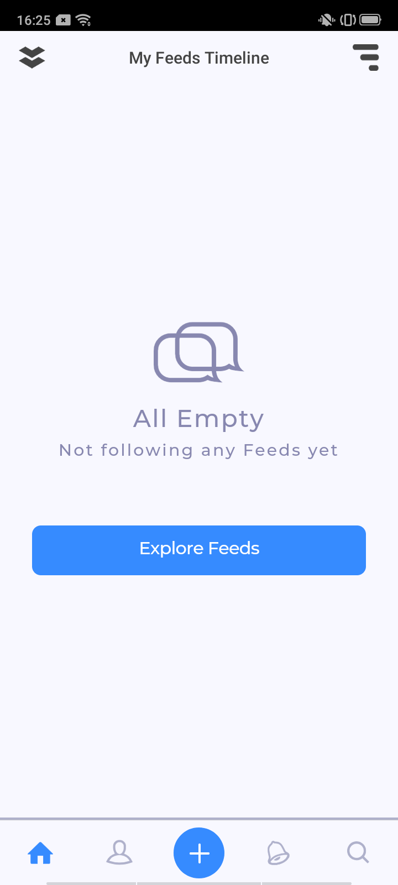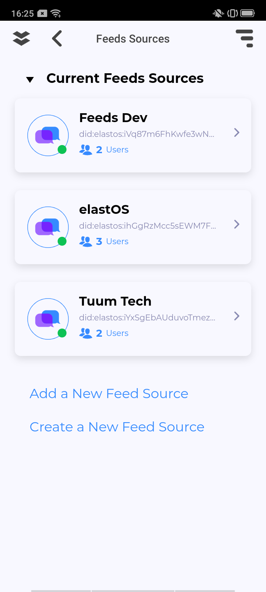

2. Click the scan icon in the middle of the page and scan the QR code of the browser page "[http://localhost:10080/](http://localhost:10080/)". The results are as follows:

   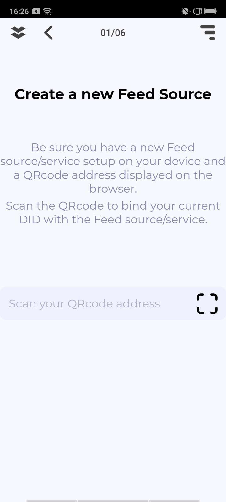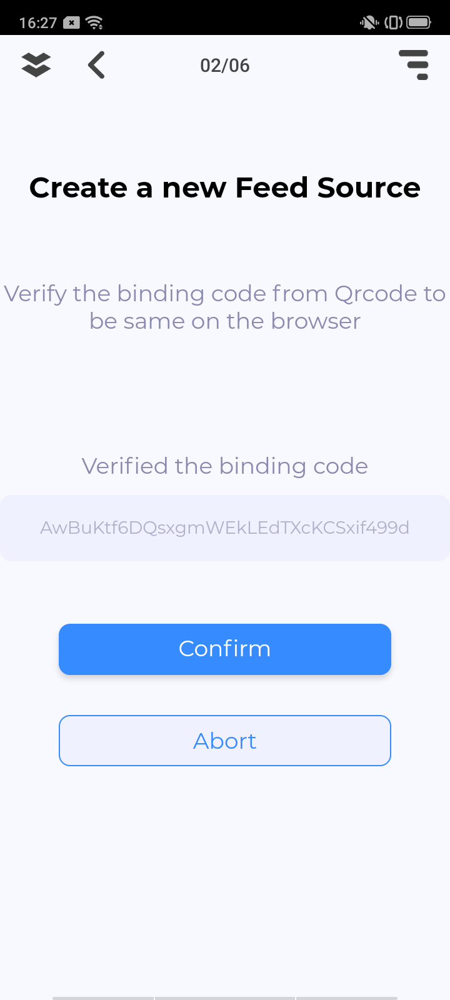

3. After confirming that it is correct, click the "Confirm" button to enter the next interface:

   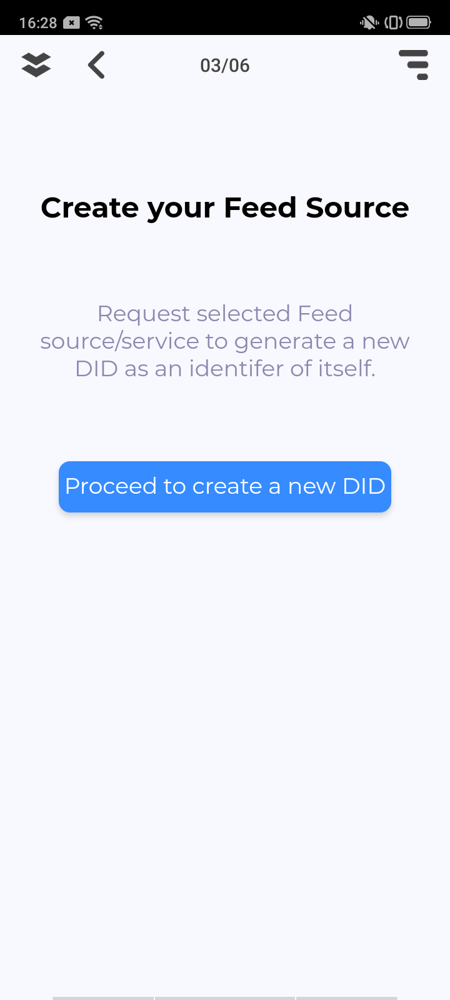

4. Click the "Proceed to create a new DID" button to generate the Service DID:

   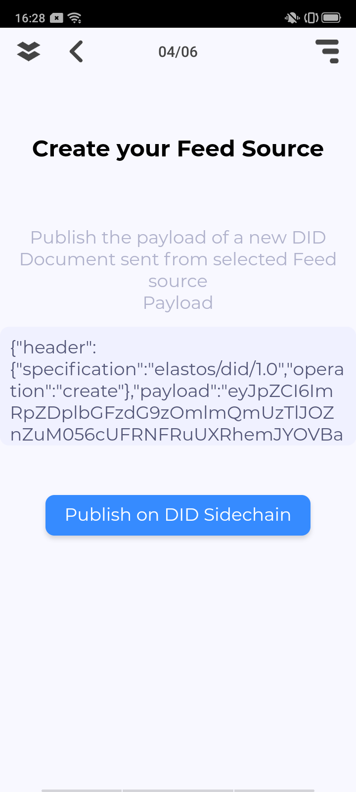

5. Click the "Publish on DID Sidechain" button to publish the DID of the Service on-chain. Users can choose to use Wallet or Assist to complete publication.

   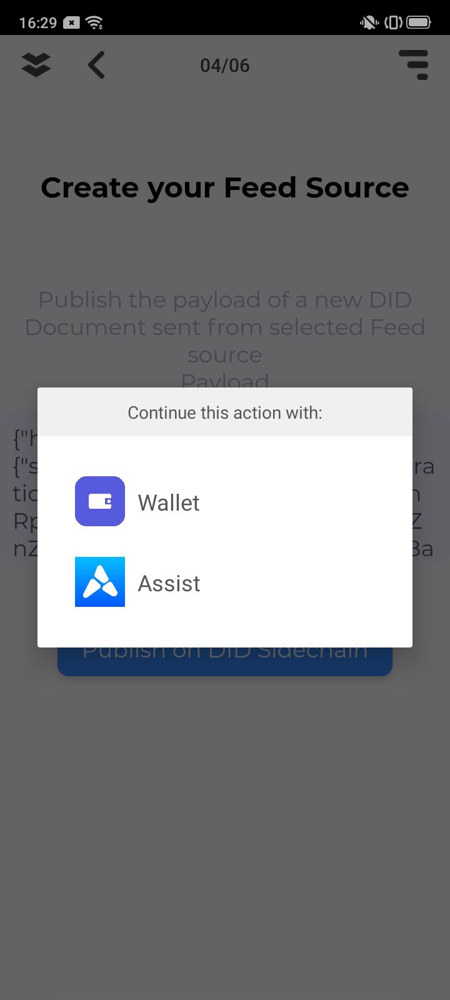

6. For an example, see the wallet screenshots below.

   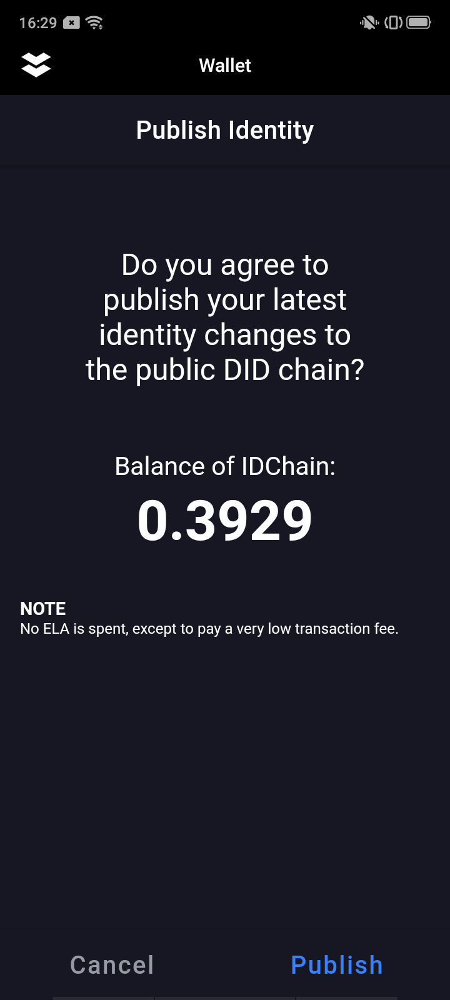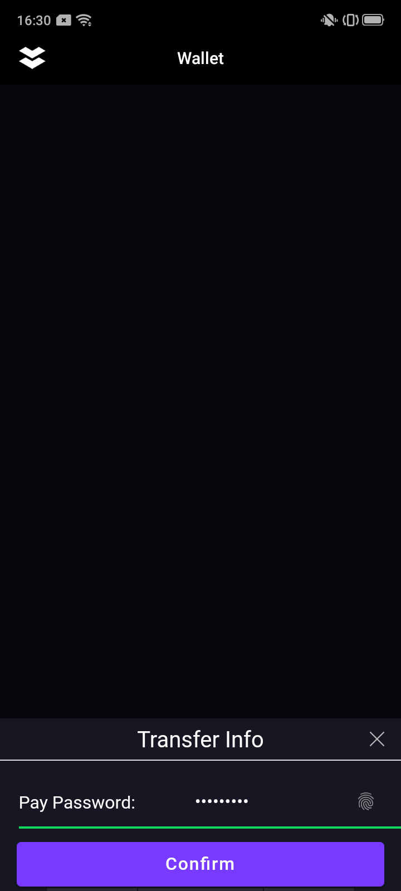

7. After the transaction is initiated, the interface transitions to the FeedsCapsule, at which point a credential must be issued to the FeedSource.

   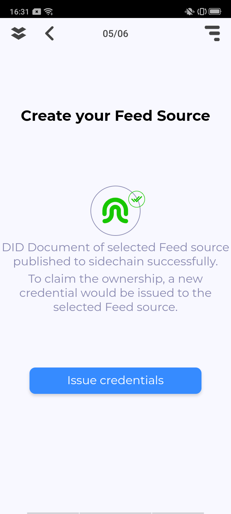

8. Click the "Issue credentials" button, enter the name,description,and ELA Address of the FeedSource in the pop-up box, click "Confirm!", and click "Accept" on the redirected request,sign the Credential interface, and then the credential will be issued successfully.

   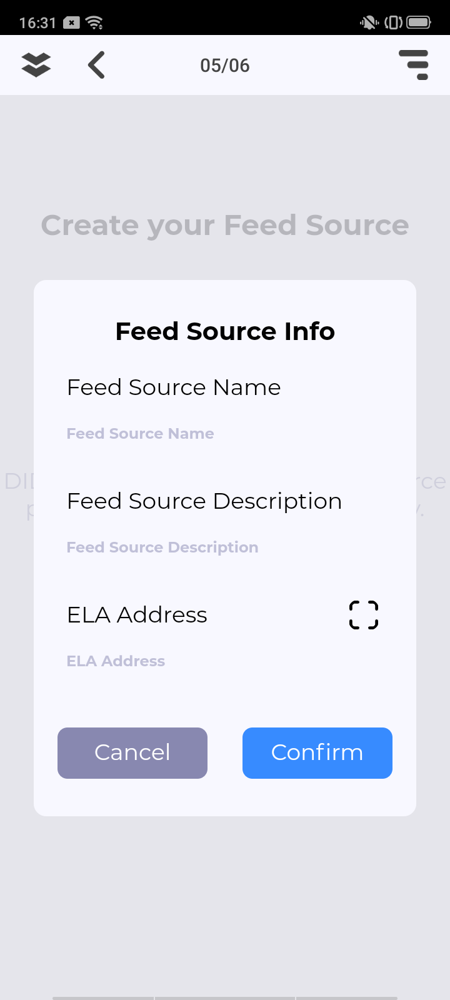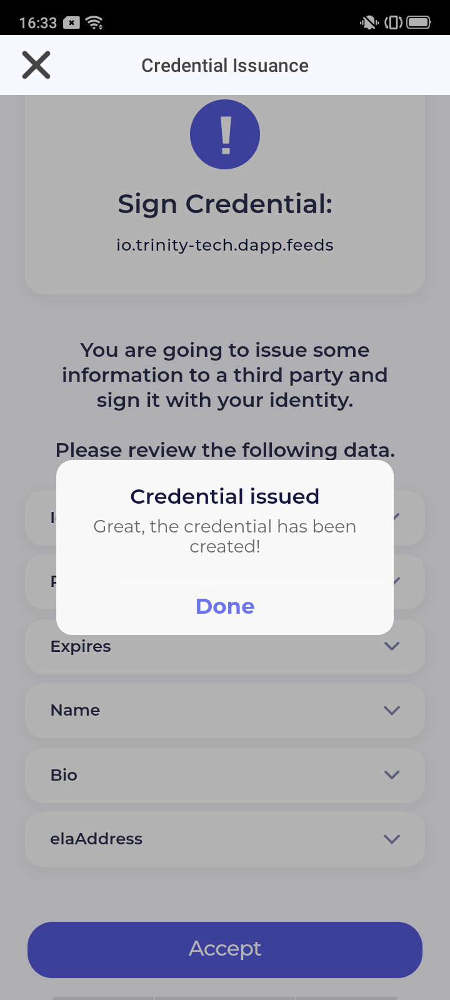

9. After the credential is issued successfully, the binding process is complete. Users can see the bound FeedsSource in the "My Feeds Sources" section of the Feeds Sources interface.

   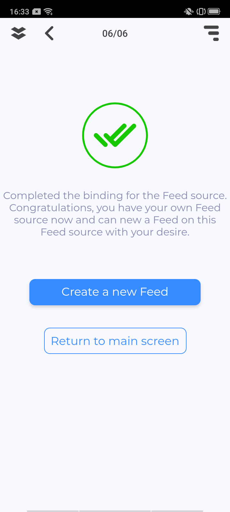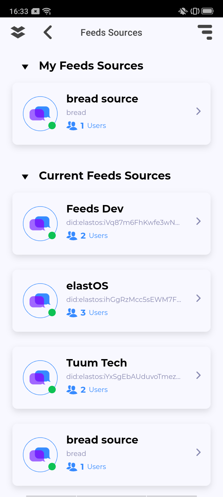

### 4.3 Create a Feed

1. Users can enter the Create Feeds interface by clicking the "+" icon on the tab page, or through the "Create a Feed"in"My Feeds",under the My Profile interface.

   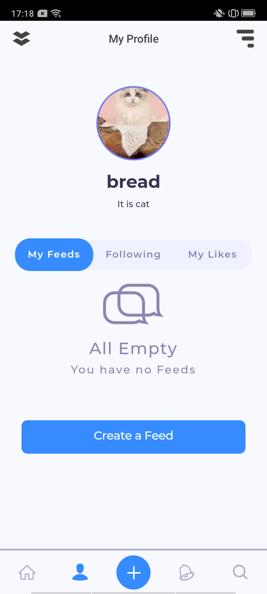

2. After opening the creation interface, edit the name, description, and avatar of the Feeds, and then click "Create a Feed" and confirm the information to create a new, unique Feeds.

   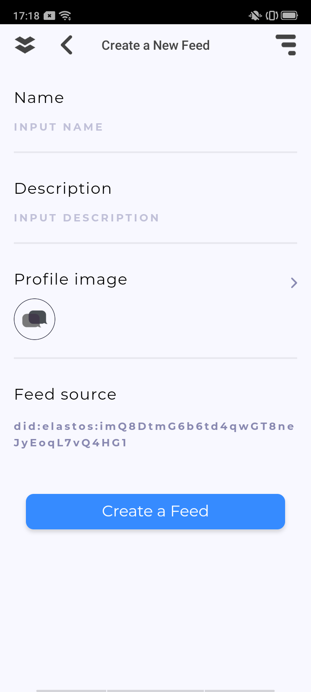

3. After creation is complete, users can see the newly created Feeds under the My Feeds page. Users may create multiple Feeds to publish different types of Posts. When users want to create Feeds in the future, they can do so by clicking "Create a New Feed".

   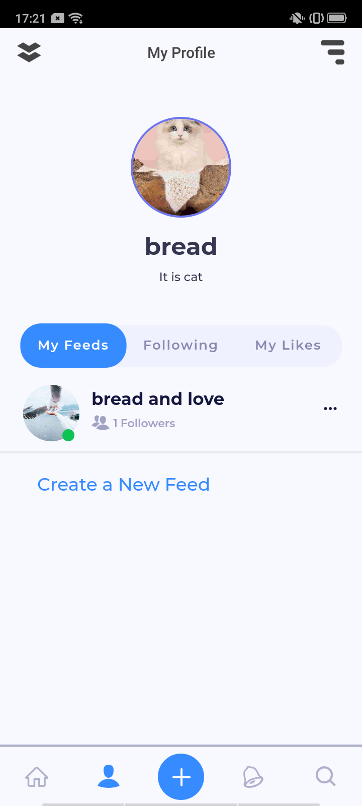

### 4.4 Create a Post

After the user has successfully created Feeds(s),aPost can be created.

1. Click the "+" icon on the tab page, select the Feeds to publish to,and jump to theEdit page;

   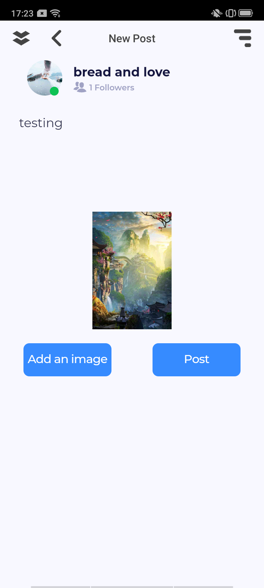

2. Users can enter text or click "Add an image" to select a picture. After editing, click "Post" to complete publication.

   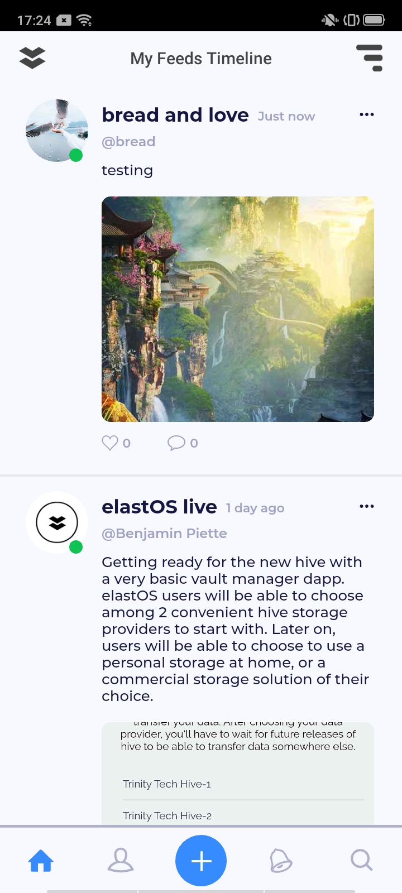

   Users can see the newly released Feeds on the My Feeds Timeline page, and users who follow particular Feeds can view them.

## 5. FAQ

**Q1：What should I do if the credential issuance process fails?**

**Answer:**

There are two types of issues which may produce a failure to issue credentials.

In the first type, the DID authorized by the user at login is not published on-chain. In the second type, the DID on-chain service is experiencing a technical problem and is temporarily unavailable. For the first type, please publish the DID on- chain; for the second type, please report the malfunction to Elastos community moderators.

**Q2：How do you publish the user's DID on-chain?**

**Answer:**

Please adhere to the following steps:

* Open elastOS' built-in "Identity" Capsule
* Click the edit icon under the avatar in the middle of the interface
* Click "Change Visibility" in the pop-up box
* Confirm the information you want to publish on-chain
* Click "Publish Changes"
* After confirming, Wallet or Assist will be requested to initiate a transaction on the DID side chain. After the transaction is confirmed, the corresponding DID will be published on the side chain.

**Tip:**

The transactions only consume a small amount of gas (transaction fees), but keep a small amount of ELA on your DID Sidechain Wallet to avoid further complications.

**Q3：How do I determine whether my DID has been published on-chain?**

**Answer:**

Provide the DID in question to Elastos community moderators, and they will be able to inform you.

**Q4：How do I share a Feeds Source with others?**

**Answer:**

* Enter the Feeds homepage
* Click the menu in the upper right corner
* Click to enter "Feeds Sources". The My Feeds Sources interface will display your own Feeds Source, and the Current Feeds Sources displays all the added Feeds Sources.
* Select the Feeds Source you want to share, and click to enter the details interface;
* You can share QR code screenshots with others. (In the future, there will be significant improvements to the Feeds Source sharing processes.)

**Q5：I uninstalled elastOS, deleted the Feeds Capsule, or deleted the bound Feeds Source. How do I recover it?**

**Answer:**

The best method is to go through the binding process once again. This time, the service will not generate a new DID, and there is no need to issue credentials again.

**Q6：The Feeds Service Capsule reports an error when launching on Mac:**

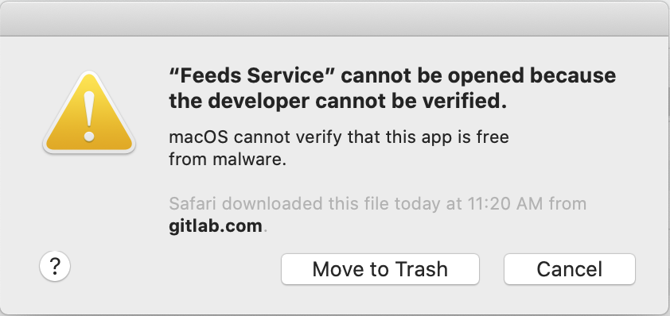

**How do I solve this problem?**

**Answer:**

Click to enter: System Preferences...->Security & Privacy->General, as shown in the figure below:

Click "Open Anyway", and then continue to click "Open" in the pop-up confirmation interface to open the Feeds Service. Finally, click "Allow" on the pop-up request link.

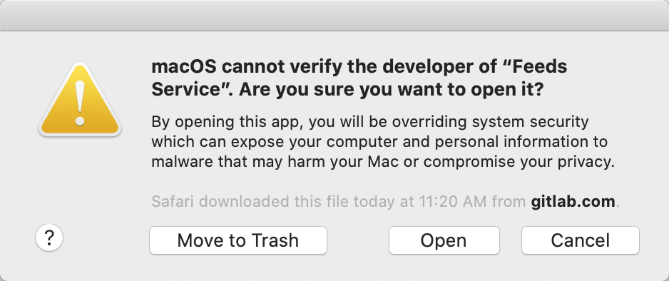

**Q7：Where are the data files for Feeds Service?**

**Answer:**

The service is running locally, and the database file is stored in ".feedsd/" under home by default.

If the database file is deleted, the Feeds created by the service - as well as the posts sent by the service - are all lost.

**Q8：Why did my ELA transfer to a Feeds address fail?**

**Answer:**

Please update your elastOS Application promptly.

**Q9：Why do I keep getting the following error when I try to Add a Feed Source: "resolve diddocument error"?**

**Answer:**

There are two possible reasons:

1. The DID Sidechain service is temporarily unavailable. In this case, please contact Elastos’ community moderators;

2. If this is not the case, it is likely that the “elastOS->Settings->Development Mode” is turned on. Please check whether the connected node is correct in “elastOS->Settings->Developer Options”.
