# 微频使用手册

**版本号：v1.0.2**

## 1. 简介

近期，期待已久的微频（简称Feeds）已发布。微频是一个基于elastOS的dapp生态项目，elastOS一直主张的一个理念是“You own you data”，微频刚好是这个理念的完美贯彻者。

微频是一个社交网络平台，致力于服务公众对话，允许用户将自己的最新动态和想法发布出去。用户可以自己部署服务器，将自己的数据控制在自己的手中。

## 2. 如何安装微频?

### 2.1 下载安装 elastOS（已安装请忽略）

elastOS可在Google Play商店中以及扫描下面的QR码来下载安装

### 2.2 安装微频

1. 点击链接通过elastOS来安装微频

   [https://scheme.elastos.org/app?id=org.elastos.dapp.feeds](https://scheme.elastos.org/app?id=org.elastos.dapp.feeds)

2. 在elastOS里下载安装微频

  * 在手机上点击elastOS图标，打开elastOS进入主页：

      <figure>
      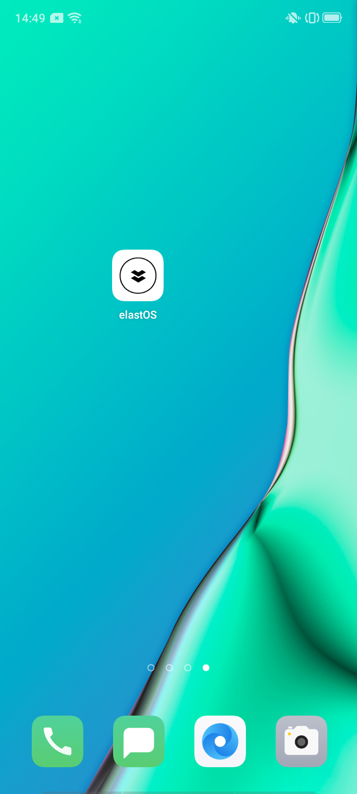
      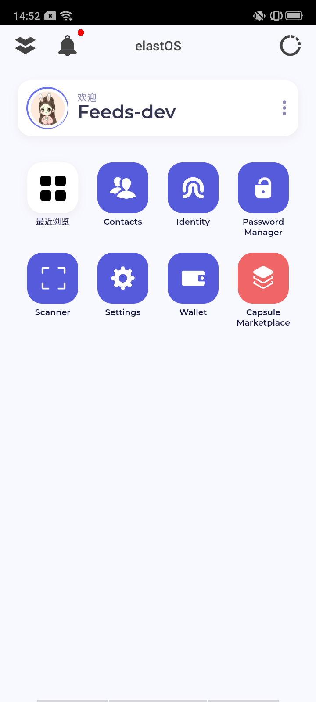
      </figure>

  * 打开“Capsule Marketplace”，在搜索框输入“Feeds”，找到后点击“INSTALL”安装。

      <figure>
      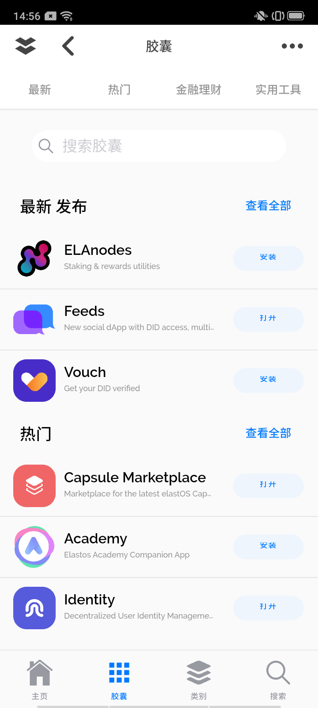
      </figure>

  * 在 “最近浏览” 下使用右侧菜单里的“收藏”来收藏微频。微频会出现在elastOS的主界面，方便后续使用。

      <figure>
      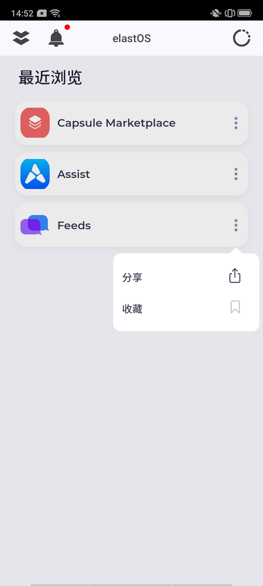
      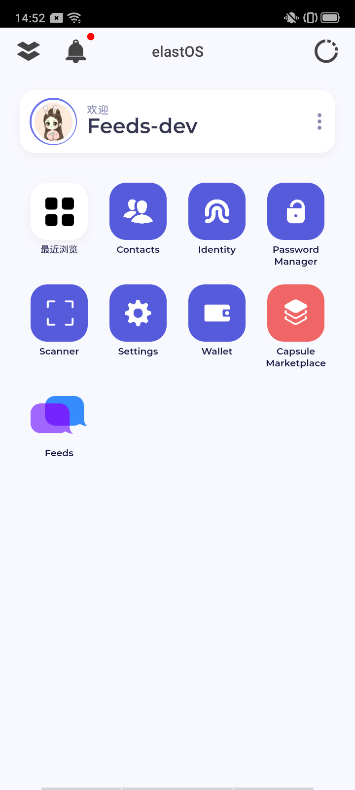
      </figure>

## 3. 如何添加微频源？

用户可以添加第三方的微频源。不需要发微说（即 Post）的用户，无需自己部署服务和绑定微频源。

默认情况下，微频本身未提供任何微频源。用户需要自己找到想要的微频源来扫码添加。当然，用户也可以添加这里推荐的微频源。

### 3.1 优选微频源推荐

* FeedsDev

  

* elastOS

  

* Tuum Tech

  

### 3.2 添加微频源步骤

1. 打开微频应用，用DID身份登录进入主页（图略；该DID身份需要上链，如果不清楚如何上链，请从“常见问题解答”中寻找答案）。
2. 点击右上角图标，进入菜单页：

   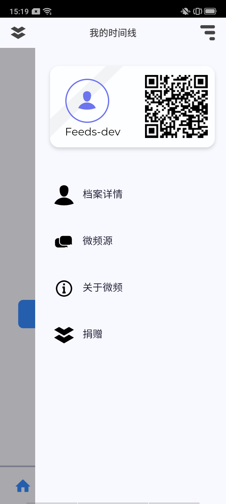

3. 点击进入“微频源”界面，如果还未绑定或者添加过，就在下面左图上点击“添加微频源”；如果已添加过请点击下面右图上“添加新的微频源”。

   <figure>
   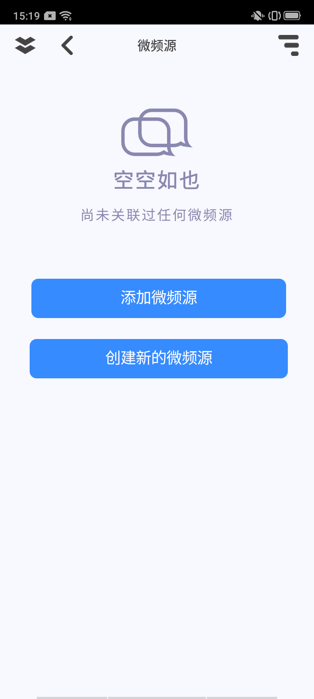
   
   </figure>

4. 进入添加微频源界面，可通过以下两种方式添加微频源：

* 在输入框内输入微频源URL（格式：feeds://did/address），点击“确认”；
* 点击“扫描微频源二维码”；

  确认无误后，点击“添加微频源”，则微频源添加成功。

   <figure>
   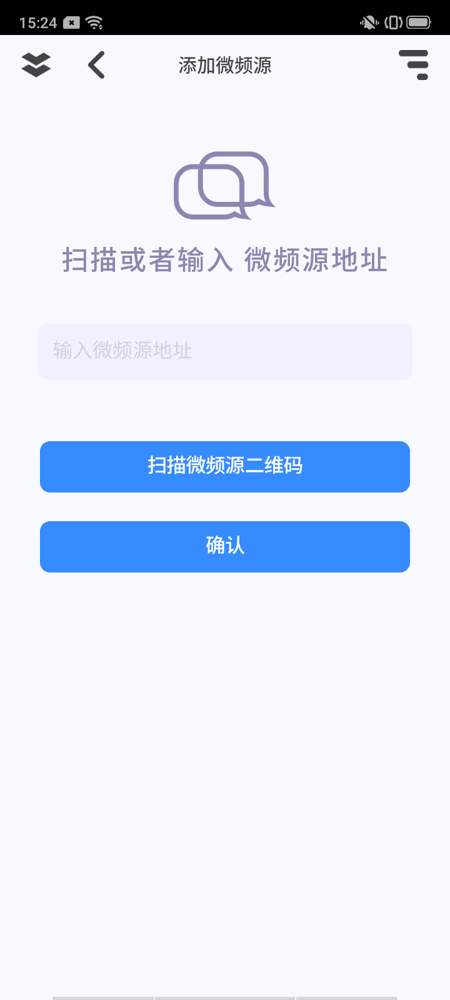
   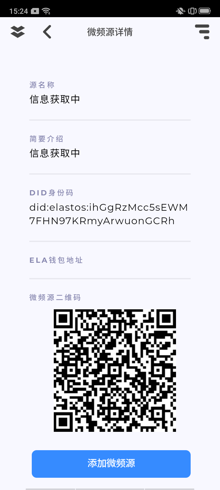
   </figure>

5. 微频源添加成功后，可在微频源界面看到新添加的微频源。

   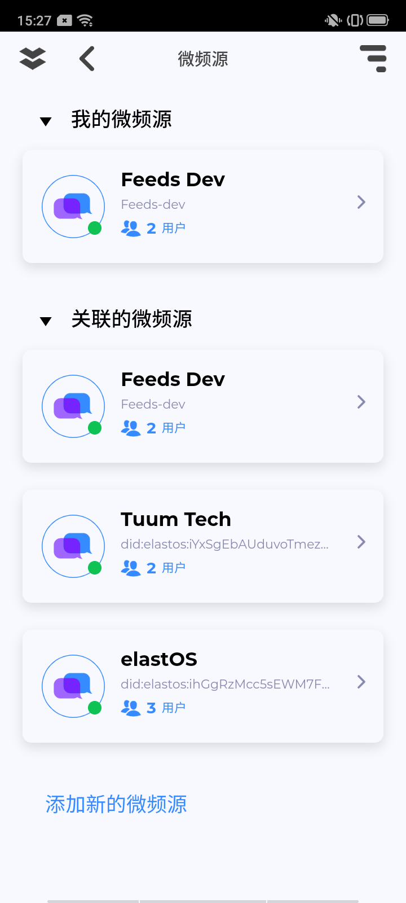

6. 进入探索微频源界面，刷新界面，可加载所有已添加的微频源下创建的所有微频。关注指定微频后，可以在“我的时间线”下查看到已关注的所有微频发布的微说。用户可以点赞微说，也可以对此微说添加微评。

   <figure>
   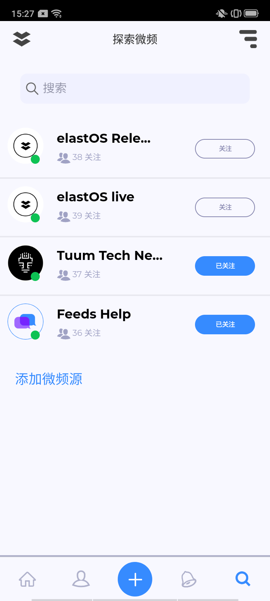
   
   </figure>

## 4. 如何发布微说？

用户如果需要发布微说，则需要自己启动服务生成微频源。绑定微频源后，才能创建微频；有了微频才能发布微说。

### 4.1 启动服务

目前支持 Mac 和 Linux 发行版 debian。

#### 4.1.1 Mac

1. 下载服务安装包

   在PC的浏览器上打开链接下载：

   [Feeds.Service.app.macos.tar.gz](https://github.com/elastos-trinity/feeds-service/releases/download/release-v1.1.0/Feeds.Service.app.macos.tar.gz)

   [查找最新版本](https://github.com/elastos-trinity/feeds-service/releases/)

2. 启动安装微频服务

* 下载后，解压打开是Feeds Service.app，如下所示：

   

* 点击“Feeds Service”应用图标会启动安装，弹出一个运行窗口，如下所示，同时会弹出一个请求链接的页面，点击“允许”即可。（如果无法打开，请到“常见问题解答”中找解决办法）

   <figure>
   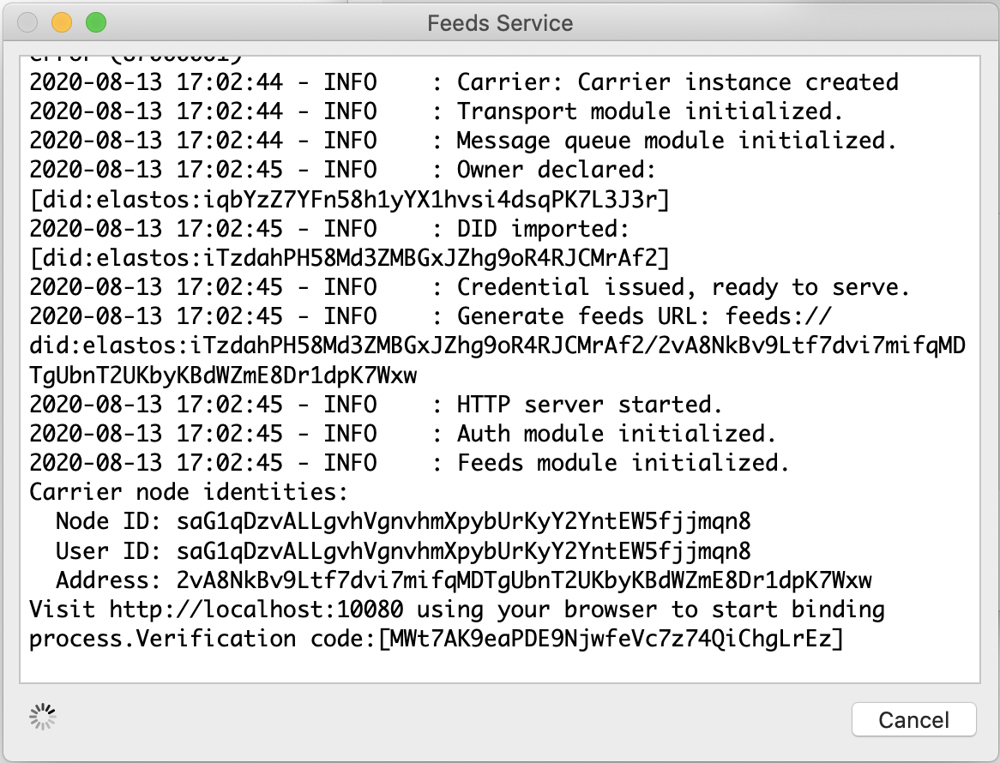
   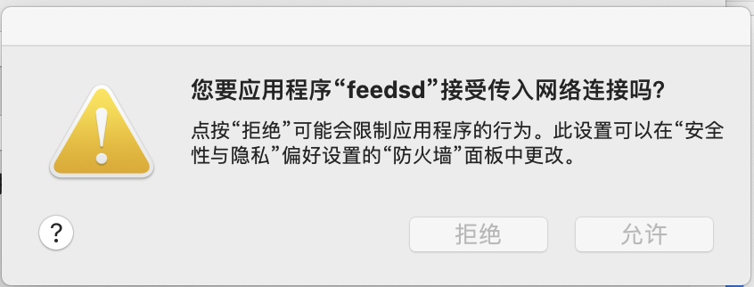
   </figure>

* 将上述窗口中的URL链接“[http://localhost:10080/](http://localhost:10080/)”拷贝到浏览器上打开，会显示一个二维码（该二维码等待微频 dapp 扫描来绑定该服务）。

#### 4.1.2 Ubuntu(amd64 debian/ubuntu)

1. 下载服务安装包

   在浏览器上打开链接：

   [feedsd_1.1.0_amd64_ubuntu_2004.deb](https://github.com/elastos-trinity/feeds-service/releases/download/release-v1.1.0/feedsd_1.1.0_amd64_ubuntu_2004.deb)

   [查找最新版本](https://github.com/elastos-trinity/feeds-service/releases/)

2. 启动安装微频服务

   选中x86_64 debian/ubuntu对应的安装包进行下载且打开：

   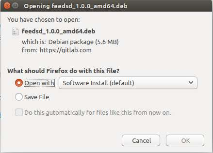

   下载完成后，自动进入“Ubuntu Software”中 对应的安装包界面：

   

   点击“Install”进行安装，根据提示输入计算机的密码：

   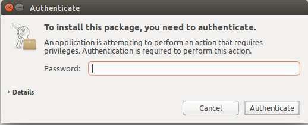

   完成安装后，刚显示的安装包界面显示“Install”按钮变为“Remove”。

   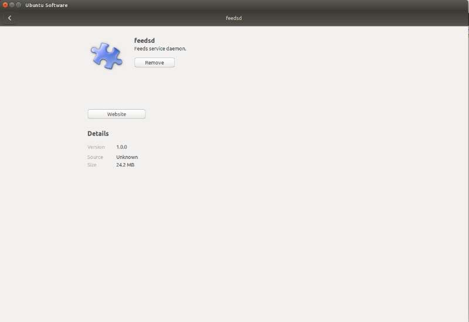

   在浏览器上打开链接：[http://localhost:10080/](http://localhost:10080/)，会显示一个二维码（该二维码等待Feeds dapp扫描来绑定该服务）。

#### 4.1.3 Ubuntu(arm debian/ubuntu)

1. 下载服务安装包

   打开链接下载：

   [feedsd_1.1.0_armhf_raspbian.deb](https://github.com/elastos-trinity/feeds-service/releases/download/release-v1.1.0/feedsd_1.1.0_armhf_raspbian.deb)

   [查找最新版本](https://github.com/elastos-trinity/feeds-service/releases/)

2. 启动安装微频服务

   与4.1.2(x86_64 debian/ubuntu)类似，不再赘述。

#### 4.1.4 Feeds Docker 镜像

1. 下载Docker

   可自行搜索下载。下载完成后，进行下一步骤。

2. 启动安装微频服务

   启动终端，在终端输入命令来下载Feeds服务的Docker 镜像并启动服务：

       docker run -d --restart=always -p 10080:10080 trinitytech/feeds

### 4.2 绑定微频源

1. 点击下方tab页的 “+” 号按钮进入绑定微频源流程（或在微频源界面的“创建新的微频源”来开启绑定过程）；

   <figure>
   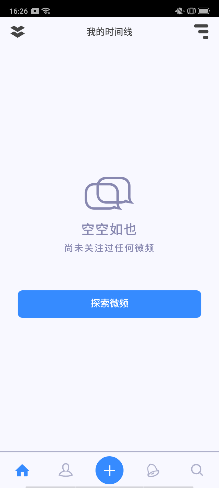
   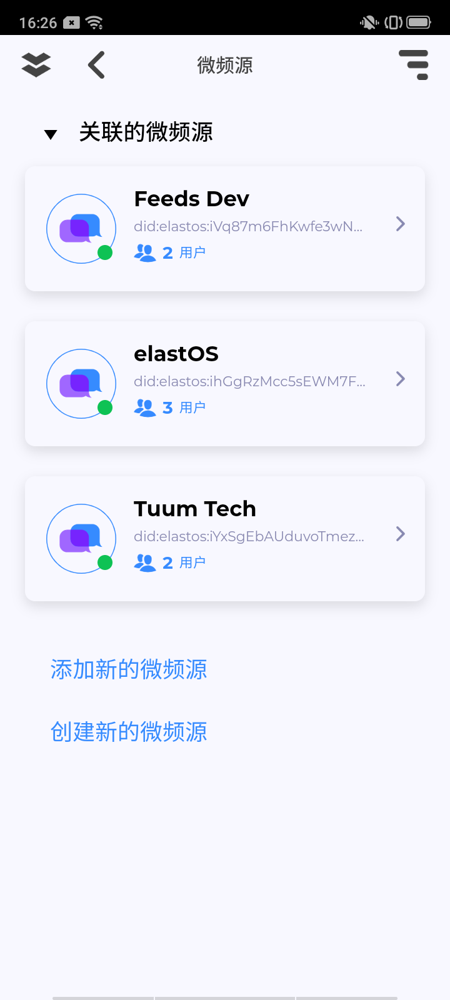
   </figure>

2. 点击页面中部的扫描图标，扫描刚搭建的浏览器页面“[http://localhost:10080/](http://localhost:10080/)”的二维码，结果如下：

   <figure>
   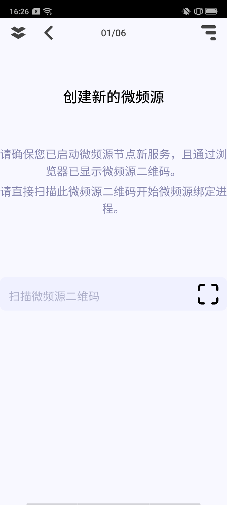
   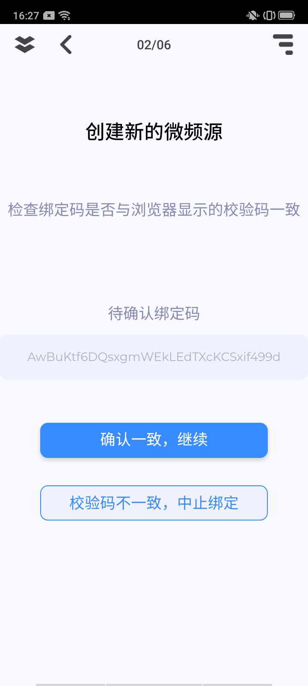
   </figure>

3. 确认无误后，点击“确认一致，继续”按钮，进入下一个界面：

   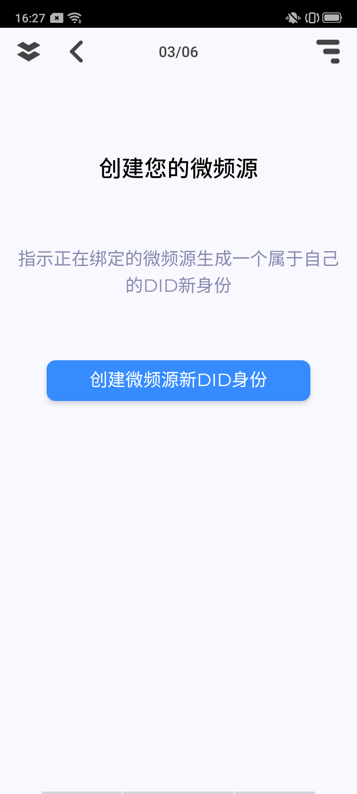

4. 点击“创建微频源新DID身份”按钮来生成服务的DID：

   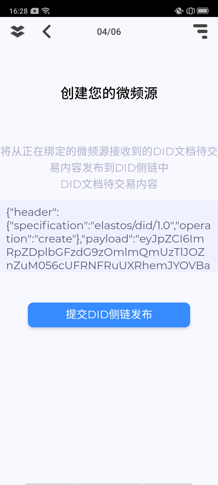

5. 点击“提交DID侧链发布”按钮，选择将服务的DID上链。可以选择使用Wallet或者Assist来做上链操作。

   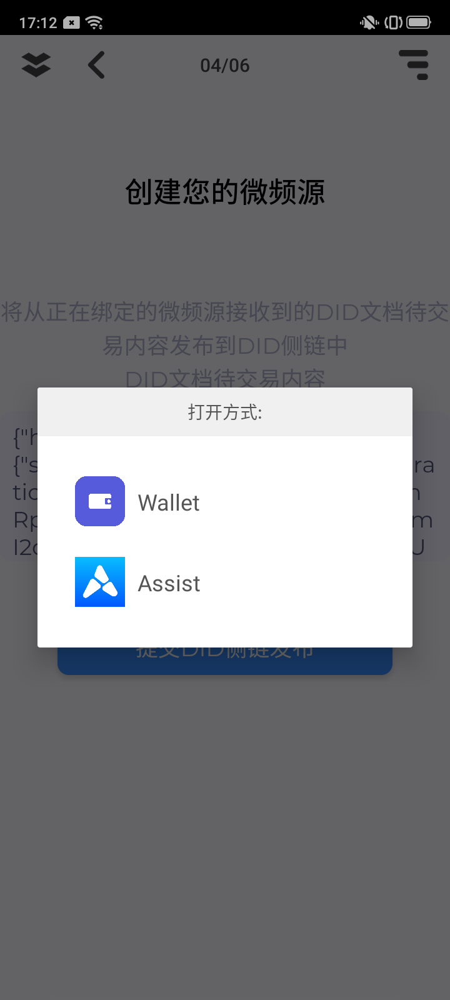

6. 此处以钱包为例来说明。

   <figure>
   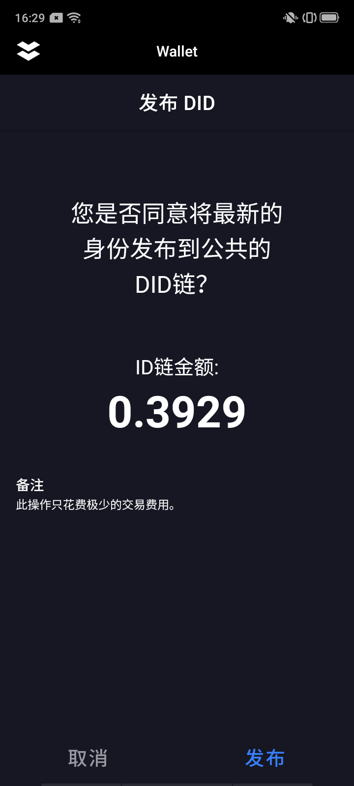
   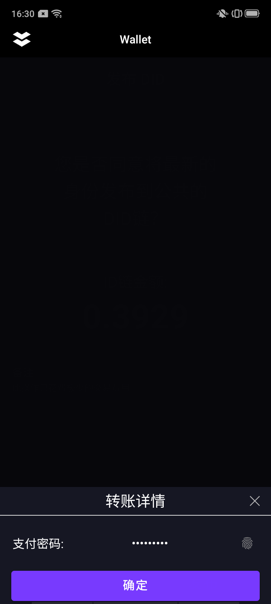
   </figure>

7. 交易发起后，界面跳转至微频应用里，接着需要给微频源颁发凭证。

   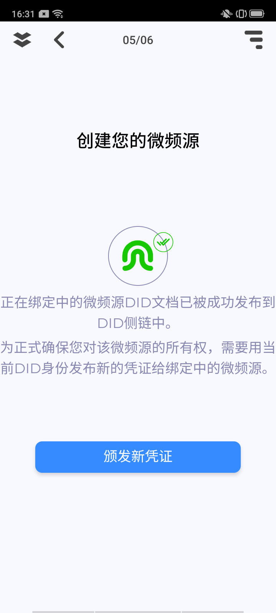

8. 点击“颁发新凭证”按钮，在弹框里输入微频源的名称、描述、ELA钱包地址，点击“确认”，在跳转的请求签名凭证界面上点击“接受”，则凭证颁发成功。

   <figure>
   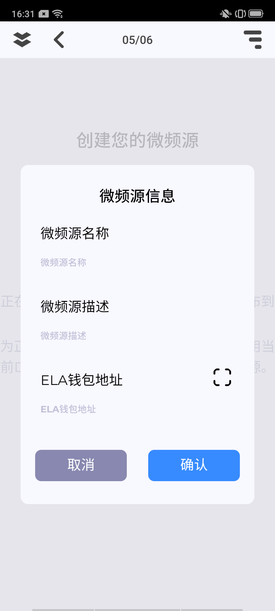
   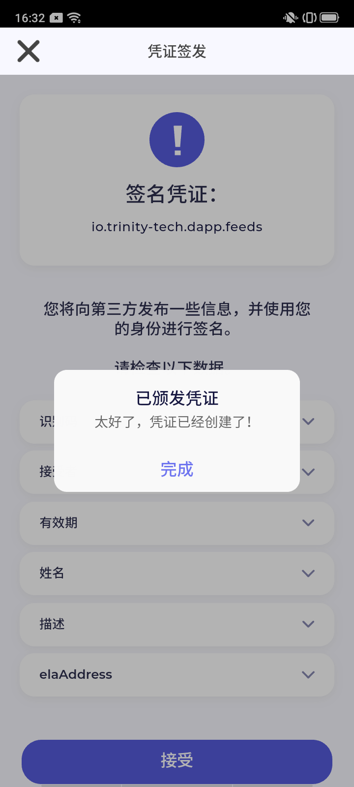
   </figure>

9. 凭证颁发成功后，则绑定过程即完成。用户可以在微频源界面的“我的微频源”部分看到绑定的微频源。

   <figure>
   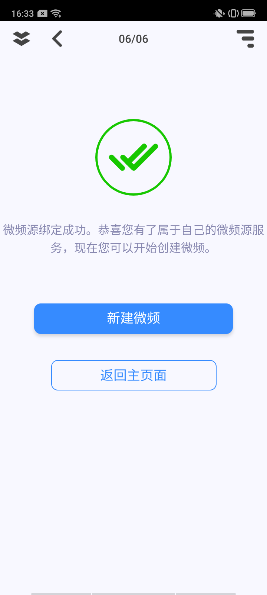
   
    </figure>

### 4.3 创建微频

1. 用户可以通过点击tab页上的“+”号图标进入“创建微频”界面；也可以通过“我的档案”界面下“我的微频”下的“创建微频”来进入。

   

2. 打开创建界面后，分别编辑微频的名称、描述、以及头像，然后点击“创建微频”,确认信息后即可成功创建。

   <figure>
   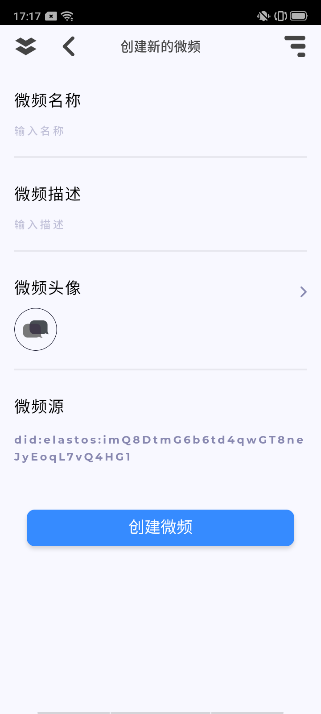
   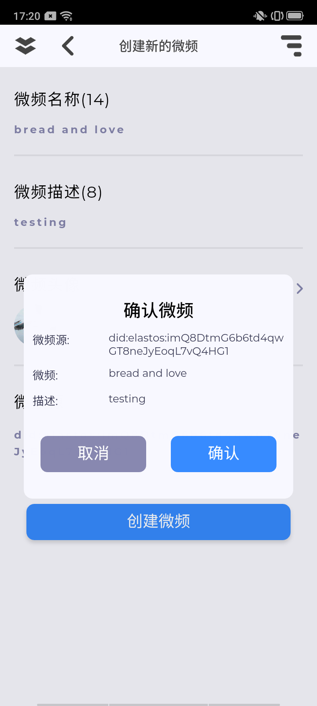
   </figure>

3. 创建完成后，可以在“我的微频”页下面看到新创建的微频。用户可以创建多个微频，用来分别发布不同种类的微说。再次创建微频时，可以通过点击“创建新的微频”来创建。

   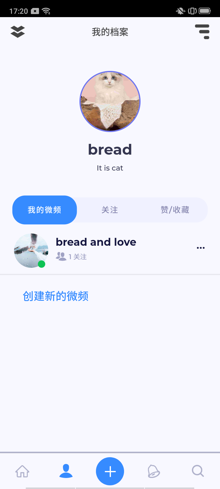

### 4.4 发布微说

用户创建微频成功后，即可开始发布微说。

1. 点击tab页上的“+”号图标，选择用来发布的微频后跳转到编辑页面；

   <figure>
   
   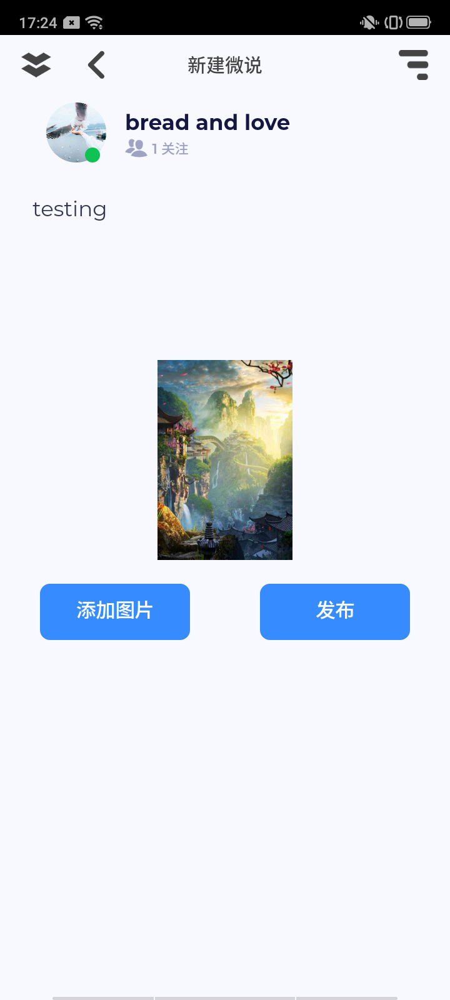
   </figure>

2. 可以输入文字，也可以通过点击“添加图片”选择图片，编辑完毕后点击“发布”即可完成发布。

   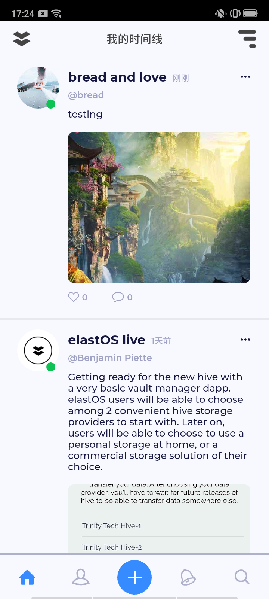

   可以在“我的时间线”页面看到新发布的微频，关注该微频的用户均可查看到。

## 5. 常见问题解答

**Q1：颁发凭证失败，如何处理？**

**答：**

颁发凭证失败有两种可能。第一种：用户授权登录的DID没有上链；第二种：DID链的服务出现问题，暂时不可用。

如果是第一种，请将DID上链；如果是第二种，请反馈给DID链的工作人员处理。

**Q2：用户的DID如何上链？**

**答：**

* 打开elastOS内置的dapp “Identity”；
* 点击界面中部头像下面的编辑图标；
* 在弹出框上点击“编辑公开档案；
* 勾选自己想要上链的信息；
* 点击“发布更新”；
* 确认后会调起Wallet或者Assist在DID链上发起交易；待交易确认后，DID即上链。

备注：上链交易仅消耗微量的交易费，在DID链的钱包上保留少量的ELA即可。

**Q3：如何确定自己的DID是否上链？**

答：提供DID给工作人员，工作人员可以帮忙查询。

**Q4：如何将Feeds源分享给其他人？**

**答：**

* 进入Feeds主页；
* 点击右上角菜单；
* 点击进入“微频源”，在“我的微频源”界面下显示的是自己的微频源；在“关联的微频源”下显示的是已添加的所有的微频源；
* 选择想要分享的微频源，点击进入详情界面；
* 可将微频源二维码截图分享给他人。（后续会改进分享方式）

**Q5：卸载了elastOS、删除了微频 dapp，或者删掉了绑定的微频源，如何恢复？**

**答：**

再次走绑定流程即可，此时服务不会生成新的DID，也不需要再颁发凭证。

**Q6：Feeds Service 应用在Mac上启动时报错：**

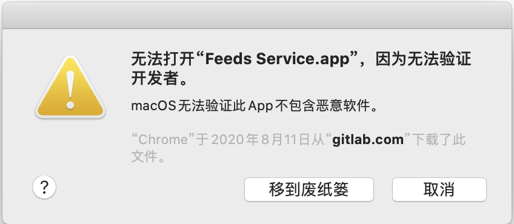

**如何解决该问题？**

**答：**

依次点击进入：系统偏好设置..->安全性与隐私->通用，如下图所示：

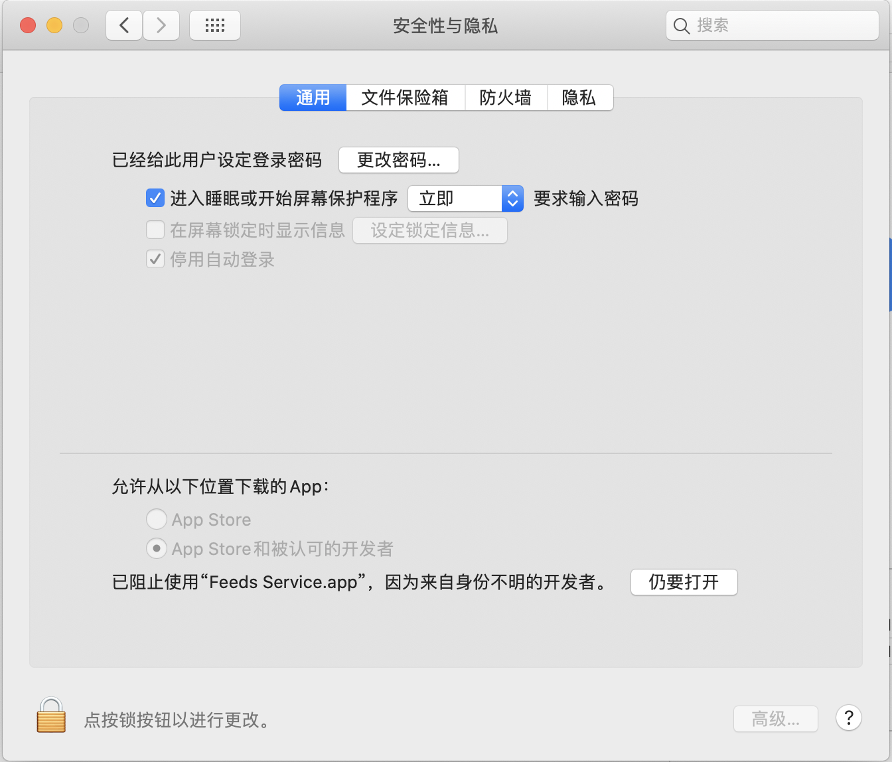

点击“仍要打开”，然后在弹出的确认打开界面继续点击“打开”，则会打开Feeds Service，然后在弹出的请求链接上点击“允许”即可。

   <figure>
   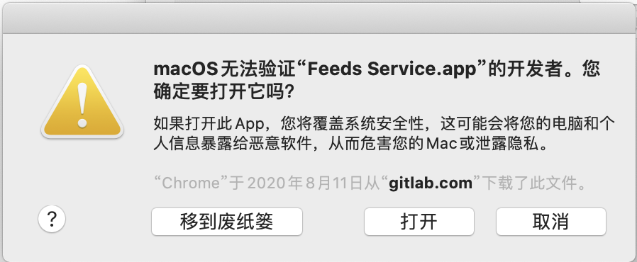
   
   </figure>

**Q7：Feeds Service服务的数据文件在哪里？**

**答：**

该服务是运行在本地的，数据库文件默认是存储在home下的“.feedsd/”。

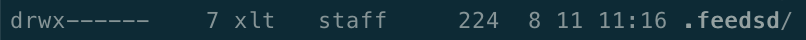

删除该数据库文件，则该服务所创建的微频以及发送的微说全部丢失。

**Q8：打赏无法顺利进行？**

**答：**

请及时更新elastOS版本。

**Q9：添加微频源报错：“解析DID文档错误”？**

**答：**

可能原因：

1. DID链服务暂不可用，请联系工作人员；

2. 如果打开了开发模式，请查看 “elastOS->设置->开发者选项” 中连接的节点是否正确。
